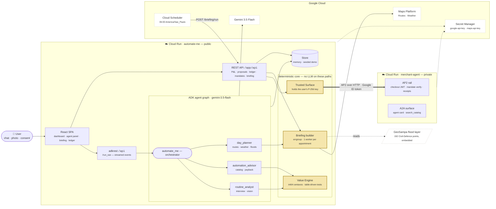
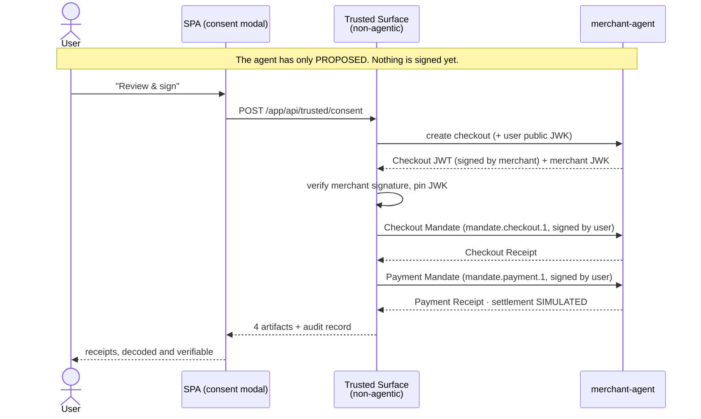

# Automate.me

**Your agent finds where your life leaks time, prices the leak in money, and buys the fix — autonomously.**

Built for the Google Cloud **"All Things Agentic"** hackathon (Track 1 — The Taskmaster).
Multi-agent system on **ADK Go v2** + **Gemini 3.5 Flash**, running on **Cloud Run**.

| | |
|---|---|
| **Live demo** | https://automate-me-288504867090.us-central1.run.app |
| **Merchant agent** | `https://merchant-agent-288504867090.us-central1.run.app` (private — only the app's service account can invoke it) |
| **Stack** | Go 1.26 · ADK Go v2.2.0 · Gemini 3.5 Flash · React 19 + Vite + Tailwind 4 |
| **Google Cloud** | Cloud Run · Cloud Build · Artifact Registry · Secret Manager · Cloud Scheduler · Maps Platform (Routes + Weather) · Cloud Logging · Cloud Trace |
| **Protocols** | **AP2 v0.2** (agent payments) · **A2A v1.0.1** (agent-to-agent) |

> Payments are **simulated and labelled as such** — but the AP2 protocol runs for real: ECDSA P-256 signed mandates, verifiable receipts, full audit trail.

---

## What it actually does

The loop is **Proof of Time**: capture → price → rank → **execute** → prove.

1. **Capture.** Tell the agent your routine in chat, or **photograph** a handwritten list, a pile of boletos, a school note. Gemini reads the pixels; the analyst confirms the numbers with you before saving.
2. **Price.** A deterministic Go **Value Engine** computes the *Cost of Inaction*: `minutes × times/month × your hourly rate`. **No LLM ever produces a money figure.**
3. **Rank.** Routines are matched against a 26-recipe catalog (8 executable, 9 advised, 9 roadmap) and ranked by payback. Negative-net automations are never proposed.
4. **Execute.** With explicit approval the agent acts: buys a dishwasher over AP2, plans the day from live traffic, writes departure blocks to the calendar.
5. **Prove.** The Savings Ledger accumulates hours and R$ bought back, with the signed AP2 receipts attached to each purchase.

### Three things worth looking at

**The agent panel is the product.** It streams over SSE, so you watch the graph work: which sub-agent took the question, which tool is running, what it returned. Tool results become cards you can act on — approve a proposal, open the consent screen, read the receipts — without leaving the conversation.

**The Daily Briefing is measured, not guessed.** For each appointment: the Routes API is called twice (rough departure, then refined at the departure it just computed, because traffic depends on when you leave), congestion is priced as `(duration − staticDuration) × your hourly rate`, the hourly forecast at departure drives a clothing line, and flood risk comes from two layers — live public alerts whose polygon your route crosses, and **192 flooding occurrences logged by São Paulo's Civil Defense** (GeoSampa), matched within 150 m of the route polyline. August is dry season in São Paulo, so the historic layer is what keeps the feature honest.

**Nothing signs money except you.** The Trusted Surface is non-agentic by construction (AP2 threat model): the user's P-256 key lives in a package no LLM code path can reach, and a mandate is only signed after the consent endpoint is called from the UI.

---

## Architecture




**The AP2 purchase, end to end** — the only path that touches money, and no LLM is on it:



Rendered copies for slides and the submission: [`docs/design/architecture.png`](docs/design/architecture.png) · [`docs/design/ap2-flow.png`](docs/design/ap2-flow.png).

Detailed design: [`DESIGN_SPEC.md`](DESIGN_SPEC.md) · product scope: [`PRD.md`](PRD.md) · verified protocol research: [`docs/research/`](docs/research/).

---

## Spin-up

### Prerequisites

- Go **1.26+**, Node **24+**
- A Gemini API key from [aistudio.google.com/apikey](https://aistudio.google.com/apikey)
- *(optional)* a Google Maps Platform key with **Routes API** + **Weather API** enabled — without it everything works except the Daily Briefing, which reports itself unavailable

### Run it locally

```bash
git clone <this repo> && cd Automate-me

cp app/.env.example app/.env      # then fill in:
#   GOOGLE_API_KEY=...            # required for the chat
#   MAPS_API_KEY=...              # optional, enables the Daily Briefing

(cd app/web && npm ci && npm run build)   # build the SPA once

make run-merchant                  # terminal 1 → :8081
make run-app                       # terminal 2 → :8080  (loads app/.env)
open http://localhost:8080
```

`make run-app` serves the built SPA, seeds a demo user (Ana, R$50/h, five routines) and mounts the agent graph. If `GOOGLE_API_KEY` is missing the dashboard still works — only the chat is disabled.

Port 8081 already taken? `PORT=8082 make run-merchant` and `MERCHANT_URL=http://localhost:8082 make run-app`.

For SPA hot-reload use `make run-web` (Vite on :5173, proxying the API).

### Verify it end to end

```bash
make test                          # go test -race, all modules
./scripts/chat-smoke.sh            # drives the real agent graph through adkrest:
                                   # interview → P&L → proposals → approve (with
                                   # tool confirmation) → dashboard state
BASE=https://your-service.run.app ./scripts/chat-smoke.sh   # same, against Cloud Run
```

### Deploy to Google Cloud

```bash
make gcp-setup                     # idempotent, safe to re-run. Creates the project
                                   # under your org, links billing, enables the 14 APIs,
                                   # Artifact Registry, the runtime service account and
                                   # its roles, a project-scoped org-policy override so
                                   # the demo can be public, both Secret Manager secrets
                                   # (reading app/.env, minting a Routes+Weather-restricted
                                   # Maps key if absent), the 06:00 briefing schedule and
                                   # a budget alert. Refuses to touch any other project.
GCP_PROJECT=automate-me-hack make deploy
```

`infra/deploy.sh` builds both images on Cloud Build (in parallel, from the repo root so the shared `ap2core` module is in the build context), then rolls out:

- **`merchant-agent`** — `--no-allow-unauthenticated`; only the app's service account holds `roles/run.invoker`, and the app authenticates with a Google-signed ID token (`MERCHANT_AUTH=idtoken`)
- **`automate-me`** — public, serving the SPA and the APIs

Both run `--max-instances=1`: the demo store, the idempotency cache and the merchant's signing key live in memory. Firestore-backed `session.Service` is the documented next step; the single-instance tradeoff is deliberate and recorded in `DESIGN_SPEC.md`.

`make gcp-setup` already registered the Cloud Scheduler job that hits
`POST /app/api/briefing/run` at 06:00 America/São_Paulo, so the briefing is built before
the user asks for it. Trigger it by hand with
`gcloud scheduler jobs run briefing-daily --location=us-central1`.

**Real calendar writes** are optional: share a Google Calendar with the runtime service account (`automate-me-run@<project>.iam.gserviceaccount.com`, permission *Make changes to events*) and set `CALENDAR_ID` on the service. Without it, departure blocks are recorded in-app and labelled `simulated` — no OAuth screen, no service-account keys (the org policy forbids them).

---

## Layout

```
ap2core/            AP2 v0.2 crypto — checkout JWT, closed mandates, receipts,
                    JWK P-256. Shared by both services. 10 test funcs.
app/
  cmd/server        wiring: SPA, REST, adkrest, agent graph
  internal/agents   the graph: orchestrator + 3 sub-agents, 7 tools
  internal/engine   Value Engine — pure Go, int64 centavos, no I/O
  internal/catalog  26 recipes as data over 7 capability enums
  internal/briefing Routes/Weather clients, polyline + geometry, GeoSampa layer
  internal/trusted  Trusted Surface — the only holder of user signing keys
  internal/shopping deterministic AP2 client (ID token on Cloud Run)
  internal/store    persistence boundary (Memory today, Firestore next)
  web/              React SPA
merchant/           AP2 merchant: catalog, mandate verification, receipts,
                    simulated settlement, A2A agent card
infra/              gcp-setup.sh · deploy.sh · cloudbuild.yaml
scripts/            chat-smoke.sh — end-to-end agent drive
```

## Quality gates

CI (`.github/workflows/ci.yml`) runs on all three Go modules: `gofmt` · `go vet` · `go fix` with no drift · `golangci-lint` · **`go test -race`** — plus the SPA typecheck and build.

Money is integer centavos everywhere, tested table-driven. The agent graph, the AP2 crypto, the geometry and the flood matching all carry tests; `scripts/chat-smoke.sh` covers the live path a demo actually walks.

## Deliberate limits

Payment **settlement** is simulated (the protocol is not). State is in memory behind a `Store` interface, so a single instance per service. Calendar writes fall back to simulated unless a calendar is shared with the runtime identity. Demo appointments are seeded rather than read from a real calendar — the Calendar Watcher is scoped as post-hackathon, along with the Plan Guardian, Teams report, voice I/O, and Open Finance.

---

*Built in public for #AllThingsAgenticHackathon.*
